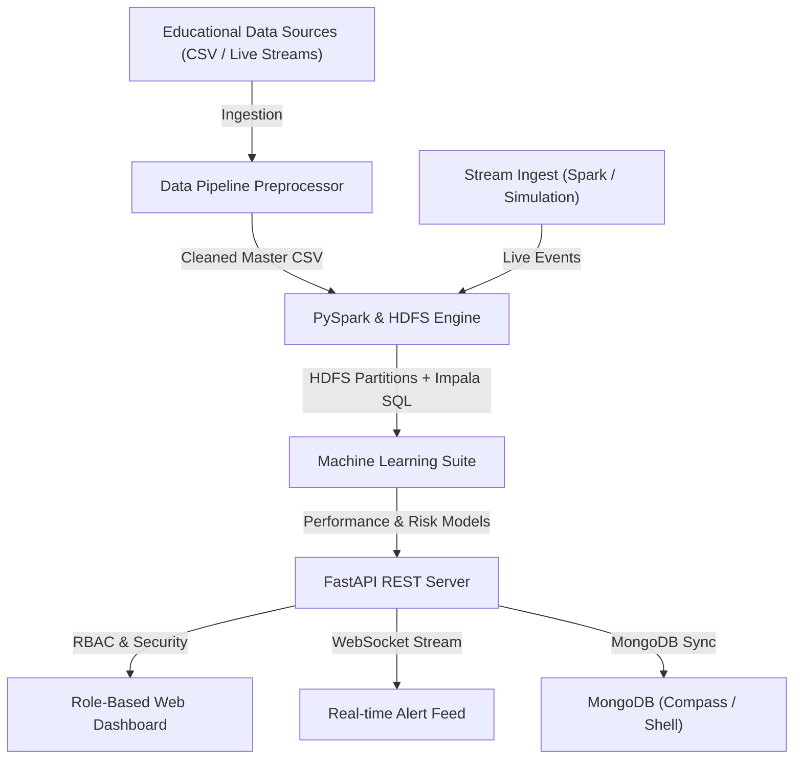

# EduPredict - System Architecture & Technical Specifications

## 1. System Overview
EduPredict is an end-to-end Big Data & Machine Learning analytics ecosystem built for educational institutions to improve student retention, optimize course allocations, and provide personalized learning intervention.

## 2. Component Specifications
- **Data Ingestion**: Multi-source parser handling Academic, Demographics, LMS Logins, Attendance, and live stream events.
- **Big Data Processing**: PySpark parallel aggregations with HDFS partitioning by risk tier and academic term; exports Impala-compatible SQL (`data/processed/impala_queries.sql`).
- **Machine Learning Suite**:
  - `RandomForestRegressor`: GPA & final score prediction.
  - `RandomForestClassifier`: Multi-class Dropout Risk (High / Medium / Low) trained on a noised composite risk score.
  - `LinearRegression`: Per-course enrollment trend forecasts (term-series demand).
  - `IsolationForest`: Academic anomaly & outlier flagger.
- **Real-Time Processing**: Spark Structured Streaming (socket path) landing into the same partitioned store as batch, with a local simulation fallback (`stream_ingest.py`).
- **Database Layer**: SQLite for the portal; MongoDB (`edupredict.students`) for the NoSQL requirement, syncable via `mongo_sync.py`.
- **Backend Service**: FastAPI with JWT tokens & Role-Based Access Control (`Administrator`, `Teacher`, `Analyst`, `Student`).
- **Real-Time Alert Engine**: Event-driven WebSockets notifying stakeholders of risk threshold breaches.
- **Configuration**: Alert/risk thresholds are centralized in `config/thresholds.json`.