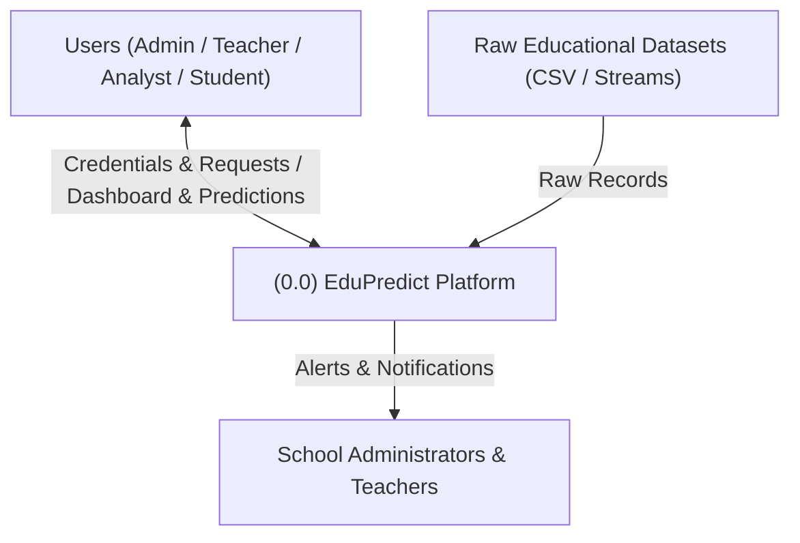
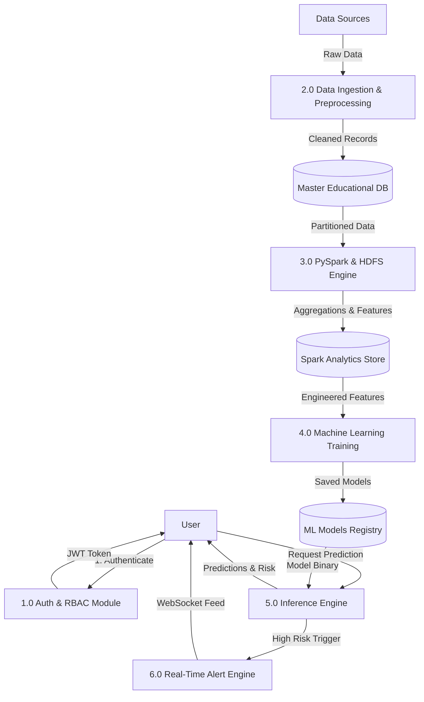

# EduPredict - Data Flow Diagrams (DFDs)

## Level 0 Context Data Flow Diagram

```mermaid
graph TD
    User["Users (Admin / Teacher / Analyst / Student)"] <-->|Credentials & Requests / Dashboard & Predictions| System["(0.0) EduPredict Platform"]
    DataSources["Raw Educational Datasets (CSV / Streams)"] -->|Raw Records| System
    System -->|Alerts & Notifications| Stakeholders["School Administrators & Teachers"]
```

## Level 1 Process Data Flow Diagram

```mermaid
graph TD
    U["User"] -->|1. Authenticate| P1["1.0 Auth & RBAC Module"]
    P1 -->|JWT Token| U
    
    DS["Data Sources"] -->|Raw Data| P2["2.0 Data Ingestion & Preprocessing"]
    P2 -->|Cleaned Records| D1[("Master Educational DB")]
    
    D1 -->|Partitioned Data| P3["3.0 PySpark & HDFS Engine"]
    P3 -->|Aggregations & Features| D2[("Spark Analytics Store")]
    
    D2 -->|Engineered Features| P4["4.0 Machine Learning Training"]
    P4 -->|Saved Models| D3[("ML Models Registry")]
    
    U -->|Request Prediction| P5["5.0 Inference Engine"]
    D3 -->|Model Binary| P5
    P5 -->|Predictions & Risk| U
    P5 -->|High Risk Trigger| P6["6.0 Real-Time Alert Engine"]
    P6 -->|WebSocket Feed| U
```
