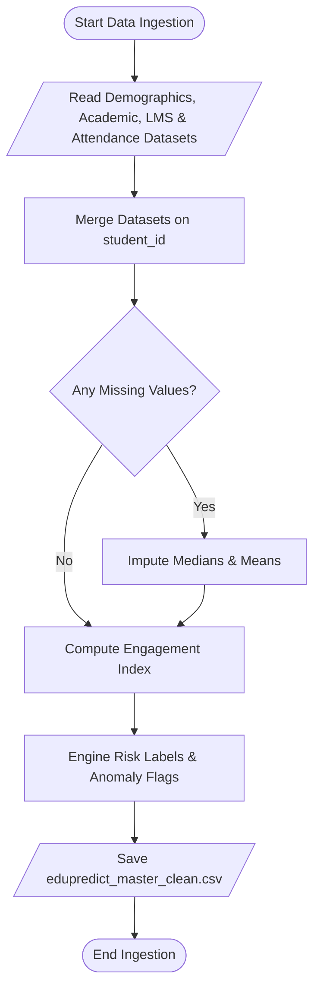
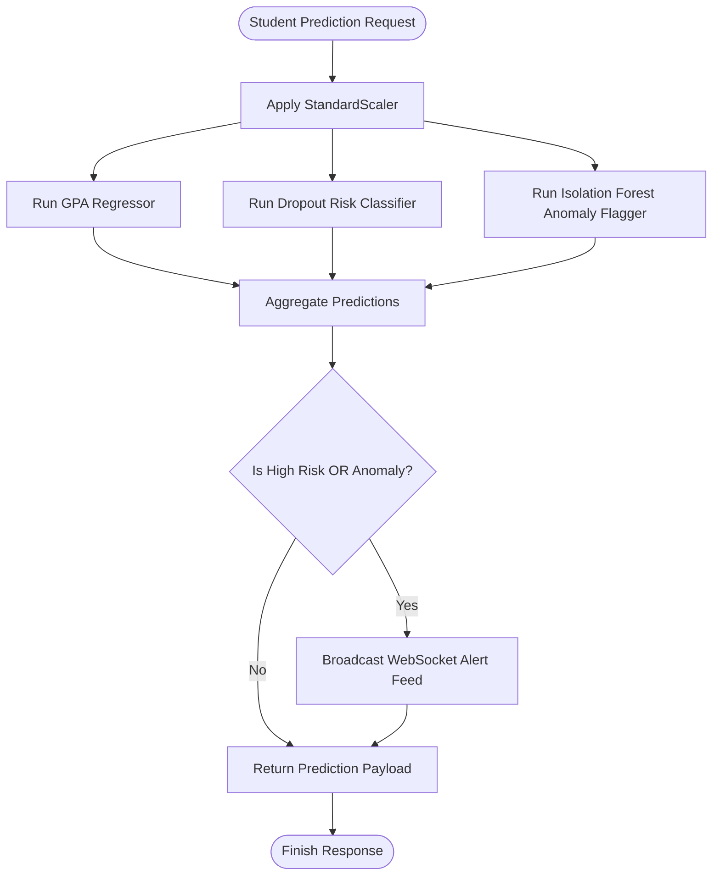

# EduPredict System Activity Flowcharts

## 1. System Data Ingestion & Preprocessing Flowchart

```mermaid
flowchart TD
    Start([Start Data Ingestion]) --> ReadRaw[/Read Demographics, Academic, LMS & Attendance Datasets/]
    ReadRaw --> MergeData[Merge Datasets on student_id]
    MergeData --> MissingCheck{Any Missing Values?}
    MissingCheck -- Yes --> FillImpute[Impute Medians & Means]
    MissingCheck -- No --> EngFeature[Compute Engagement Index]
    FillImpute --> EngFeature
    EngFeature --> TargetLabel[Engine Risk Labels & Anomaly Flags]
    TargetLabel --> SaveMaster[/Save edupredict_master_clean.csv/]
    SaveMaster --> End([End Ingestion])
```

## 2. Machine Learning Inference & Real-Time Alert Flowchart

```mermaid
flowchart TD
    Req([Student Prediction Request]) --> ScaleFeatures[Apply StandardScaler]
    ScaleFeatures --> Model1[Run GPA Regressor]
    ScaleFeatures --> Model2[Run Dropout Risk Classifier]
    ScaleFeatures --> Model3[Run Isolation Forest Anomaly Flagger]
    Model1 & Model2 & Model3 --> CombineRes[Aggregate Predictions]
    CombineRes --> RiskCheck{Is High Risk OR Anomaly?}
    RiskCheck -- Yes --> PushAlert[Broadcast WebSocket Alert Feed]
    RiskCheck -- No --> ReturnRes[Return Prediction Payload]
    PushAlert --> ReturnRes
    ReturnRes --> Stop([Finish Response])
```
